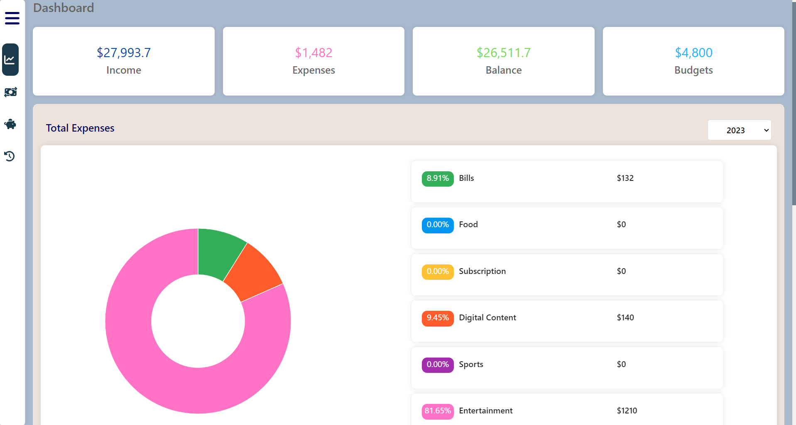

## About

Users may keep an eye on and manage their financial activities with the use of an expense tracker website. It arranges income and spending, offers insights via graphs and charts, and encourages efficient planning for better money management.

Live Demo: [Expense Tracker](https://expense-tracker-978fe.web.app/)

### Built With:
* React JS
* Firebase
* Bootstrap CSS

### Screenshots:

